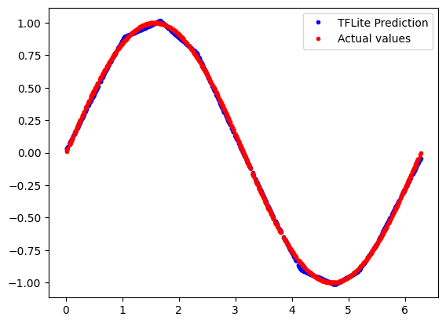

<!-- mdformat off(b/169948621#comment2) -->

# Hello World Example

This example is designed to demonstrate the absolute basics of using [TensorFlow
Lite for Microcontrollers](https://www.tensorflow.org/lite/microcontrollers).
It includes the full end-to-end workflow of training a model, converting it for
use with TensorFlow Lite for Microcontrollers for running inference on a
microcontroller.

## Table of contents

-   [Run the evaluate.py script on a development machine](#run-the-evaluate-script-on-a-development-machine)
-   [Run the tests on a development machine](#run-the-tests-on-a-development-machine)
-   [Train your own model](#train-your-own-model)

## Run the evaluate.py script on a development machine
The evaluate.py script runs the hello_world.tflite model with x_values in the 
range of [0, 2*PI]. The script plots a diagram of the predicted value of sinwave
using TFLM interpreter and compare that prediction with the actual value
generated by the numpy lib.
```bash
bazel build :evaluate
bazel run :evaluate
bazel run :evaluate -- --use_tflite
```
   

## Run the evaluate_test.py script on a development machine
These tests verify the input/output as well as the prediction of the
hello_world.tflite model. There is a test to also verify the correctness of
the model by running both TFLM and TFlite interpreter and then comparing the
prediction from both interpreters.
```bash
bazel build :evaluate_test
bazel run :evaluate_test
```

## Run the tests on a development machine

Run the cc test using bazel
```bash
bazel run tensorflow/lite/micro/examples/hello_world:hello_world_test
```
And to run it using make 
```bash
make -f tensorflow/lite/micro/tools/make/Makefile test_hello_world_test
```

The source for the test is [hello_world_test.cc](hello_world_test.cc).
It's a fairly small amount of code that creates an interpreter, gets a handle to
a model that's been compiled into the program, and then invokes the interpreter
with the model and sample inputs.

## Train your own model

So far you have used an existing trained model to run inference on
microcontrollers. If you wish to train your own model, here are the scripts 
that can help you to achieve that. 

```bash
bazel build tensorflow/lite/micro/examples/hello_world:train
```
And to run it
```bash
bazel-bin/tensorflow/lite/micro/examples/hello_world/train --save_tf_model 
--save_dir=/tmp/model_created/
```
The above script will create a TF model and TFlite model inside the 
`/tmp/model_created` directory. 

Now the above model is a `float` model. Means it can take floating point input
and can produce floating point output. 

If we want a fully quantized model we can use the `ptq.py` script inside the 
quantization directory. The `ptq.py` script can take a floating point TF model 
and can produce a quantized model.

Build the `ptq.py` script like
```bash
bazel build tensorflow/lite/micro/examples/hello_world/quantization:ptq
```

Then we can run the `ptq` script to convert the float model to quant model as 
follows. Note that we are using the directory (`/tmp/model_created`) of the 
TF model as the source_model_dir here. The quant model 
(named `hello_world_int8.tflite`) will be created inside the target_dir.
The `ptq.py` script will convert the `TF model` found inside the 
`/tmp/model_created` folder and convert it to a `int8` TFlite model.
```bash
bazel-bin/tensorflow/lite/micro/examples/hello_world/quantization/ptq  
--source_model_dir=/tmp/model_created --target_dir=/tmp/quant_model/
```

