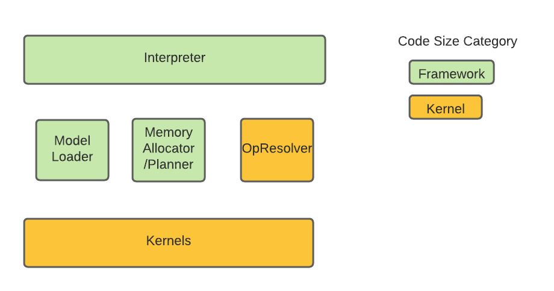

<!--ts-->

*   [TFLM Code Size FAQ](#tflm-code-size-faq)
    *   [Methodology to estimate code size of TFLM](#methodology-to-estimate-code-size-of-tflm)
    *   [Sample code size of the TFLM Framework](#sample-code-size-of-the-tflm-framework)
    *   [Tips to improve code size](#tips-to-improve-code-size)
        *   [Only register kernels that a model needs](#only-register-kernels-that-a-model-needs)

<!-- Added by: deqiangc, at: Mon 27 Sep 2021 05:44:45 PM PDT -->

<!--te-->

# TFLM Code Size FAQ

This document outlines basic steps to measure the code size of TFLM. On a
platform based on ELF file format, the code size refers to the text section size
of an ELF file. Additionally, this document outlines some common tips to keep
the code size small.

Note that a complete application that depends on the TFLM typically would also
include a TFLite model in flatbuffer and a memory arena, which are in data
sections of an ELF file. Their size is an important aspect to the overall memory
footprint, but not discussed in this document.

## Methodology to estimate code size of TFLM

Based on the [architecture description](https://arxiv.org/pdf/2010.08678.pdf),
we further classify the source code into two categories: TFLM framework and
kernels as illustrated in the below diagram:



TFLM Framework includes infrastructure such as interpreter, memory planner etc.
The size of TFLM Framework is a fixed cost of using TFLM and primarily includes
codes under tensorflow/lite/micro, but excludes those in
tensorflow/lite/micro/kernels.

On the other hand, the code size contribution from the kernels depends on and
scales with the model that an application uses. This contribution from the
kernels mostly includes the codes in tensorflow/lite/micro/kernels as well as
third party libraries.

To measure the size of the TFLM Framework that is independent of a model, the
methodology that is adopted in this document is as follows:

1.  Build the `baseline_memory_footprint` target in
    `tensorflow/lite/micro/examples/memory_footprint/`. Estimate its code size
    via a `size` command.
1.  Build the `interpreter_memory_footprint` target in
    `tensorflow/lite/micro/examples/memory_footprint/`. Estimate its code size
    via a `size` command.
1.  Subtract the two sizes from the above two steps provides the code size
    estimation of the TFLM Framework.

Step 1 gives the code size for a "no-op application" that would typically
include platform-specific initialization. We assume that this is a fixed size
that is independent of TFLM.

Step 2 produces a binary that includes the code needed to create an interpreter
instance (i.e. the TFLM framework). It explicitly avoids pulling in any kernel
code such that the increase between step 2 and step 1 is a reasonable estimate
of the footprint of the TFLM framework. Note that since we do not register any
kernel code, the binary from step 2 can not run any actual inference.

The code size estimation via the above steps also include additional system
libraries that need to be pulled in due the use of the TFLM.

A similar process can be adopted to further estimate the size of kernels. For
example, the size of kernels used in keyword detection can be estimated by the
following steps

1.  Build the `keyword_benchmark` target in `tensorflow/lite/micro/benchmarks`.
    Estimate its code size via a `size` command.
1.  Subtract to get the code size difference between the `keyword_benchmark` and
    `interpreter_memory_footprint`

It may be worth noting that the above methodology will attribute the code size
from `MicroMutableOpResolver` towards the code size of kernels, instead of
counting them in the code size estimation of the TFLM Framework. We adopt this
methodology due to its simplicity, robustness and the ability to include the
contribution of system libraries.

## Sample code size of the TFLM Framework

The below code size number of the TFLM Framework is shown as references only.

For a 64 bit x86 platform, the TFLM code size obtained through the above method
is 20411 bytes.

For an embedded bluepill ARM platform, the TFLM code size obtained through the
above method is 9732 bytes.

## Tips to improve code size

### Only register kernels that a model needs

One common issue that leads to unnecessary large code size is forgetting to only
register only kernels that a model needs and ending up registering all kernels.

TFLM provides a convenient `tflite::AllOpsResolver` that register for all
kernels that TFLM supports. This is useful when at the exploration stage and the
model is not fixed yet. However, as its name suggests, it will inlcude all
kernels into the binary and the deadcode removal of linker will not be able to
remove those kernels that is never used.

Therefore, when moving off the exploration stage, it is better to only register
for kernels that the model needs to have a smaller footprint. The following code
snipet shows how to do so using the keyword detection as an example:

```
  // Create OpResolver class with up to 6 kernel support.
  using KeywordOpResolver = MicroMutableOpResolver<6>;

  // Avoid the usage of new by placement new
  uint8_t op_resolver_buffer[sizeof(KeywordOpResolver)];
  KeywordOpResolver* op_resolver = new (op_resolver_buffer) KeywordOpResolver();

  // Only add the required kernel
  op_resolver->AddFullyConnected(tflite::Register_FULLY_CONNECTED_INT8());
  op_resolver->AddQuantize();
  op_resolver->AddSoftmax(tflite::Register_SOFTMAX_INT8_INT16());
  op_resolver->AddSvdf(tflite::Register_SVDF_INT8());

  ...

  // Pass the OpResolver to the interpreter
  tflite::MicroInterpreter * interpreter = tflite::MicroInterpeter::Create(
      g_keyword_scrambled_model_data, op_resolver, tensor_arena, kTensorArenaSize, profiler);
```

TODO(b/201351077): add more tips to improve code size.
